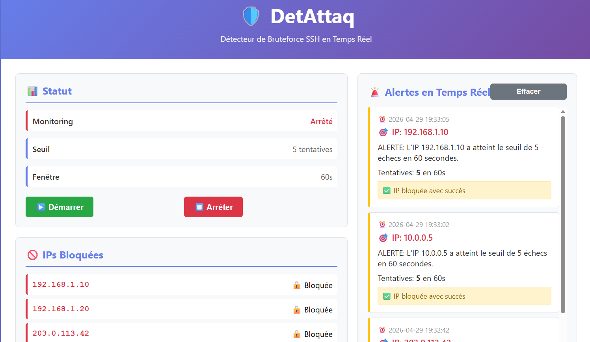

# DetAttaq

## Description

`DetAttaq.py` est un détecteur de bruteforce SSH basé sur l'analyse continue des logs.
Le script surveille un fichier de log en temps réel, extrait les adresses IP des tentatives d'authentification échouées,
compte les tentatives dans une fenêtre temporelle et déclenche des alertes ou bloque l'IP selon la plateforme.



## Fonctionnalités

- Surveillance en continu d'un fichier de log (`tail -f`)
- Détection des échecs de mot de passe SSH en français et en anglais
- Extraction de l'adresse IP source depuis les logs
- Comptage des tentatives sur une période configurable
- Blocage d'IP via `iptables` sous Linux ou `netsh` sous Windows
- Mode test sans blocage réel avec `--no-block`
- Interface web Flask optionnelle pour gestion en temps réel

## Installation

### Prérequis

- Python 3.8+ installé
- Sur Linux : accès aux logs (`/var/log/auth.log`, `/var/log/secure` ou `/var/log/messages`)
- Sur Windows : accès à un fichier de log de test ou au journal Windows Event Log

### Installation
1. Cloner ou copier le fichier compresser du projet https://github.com/EphraimMY/detect-attaque
2. Décompresser le fichier .zip
3. Placer le dossier dans le répertoire `C:\Windows\System32`
4. Activer un environnement virtuel Python (optionnel mais recommandé)

### Installation Python

```bash
python -m venv .venv
# Linux/macOS
source .venv/bin/activate
# Windows PowerShell
.\.venv\Scripts\Activate.ps1
```

### Dépendances

```bash
pip install -r requirements.txt
```

## Usage

### Exécution de base

```bash
python "C:\Windows\System32\Detect_Attaque&Analyse_Fail\DetAttaq.py" --ignore-platform-check --log-output "detattaq.log" --web
```

### Options importantes

- `--log-file <chemin>` : chemin du fichier de log à surveiller
- `--workers <n>` : nombre de threads de traitement
- `--no-block` : mode test, ne bloque pas réellement les IP
- `--log-output <fichier>` : enregistre les événements dans un fichier de log
- `--stop-file <fichier>` : arrête proprement le script si ce fichier existe
- `--ignore-platform-check` : force l'exécution même sur une plateforme non reconnue
- `--web` : lance l'interface Flask
- `--read-from-start` : lit le fichier de log depuis le début
- `--windows-events enable|disable|auto` : contrôle la surveillance des événements Windows

### Exemple Windows

```bash
python "C:\Windows\System32\Detect_Attaque&Analyse_Fail\DetAttaq.py" --log-file "C:\Windows\System32\Detect_Attaque&Analyse_Fail\api\logs\test_auth.log" --web
```

## Exemple de résultat

Lorsque le script détecte des tentatives de connexion répétées, il affiche une alerte et, en mode normal, un blocage :

```text
2026-04-02 12:00:00 [ERROR] [ALERTE] L'adresse IP 10.0.0.1 a 5 échecs en 60s
2026-04-02 12:00:00 [INFO] [ACTION] L'IP 10.0.0.1 a été bloquée.
```

## Simulation de logs

Le projet contient un script `simulate_logs.py` qui génère des entrées de logs SSH dans `api/logs/test_auth.log`.
Le répertoire `api/logs` est créé automatiquement si nécessaire.

## Notes

- Sur Linux, le blocage réel nécessite des privilèges root pour utiliser `iptables`.
- Sur Windows, le blocage passe par `netsh` lorsqu'il est disponible.
- En mode `--no-block`, le détecteur analyse les logs uniquement sans appliquer de blocage réseau.
- `server_app.py` et `DetAttaq.py` utilisent Flask pour l'interface web.

## Fichier `requirements.txt`

Ce fichier contient les dépendances Python requises pour exécuter l'interface web et le projet.

## Auteur
MBOUMBA YANDREPOT Ephraïm